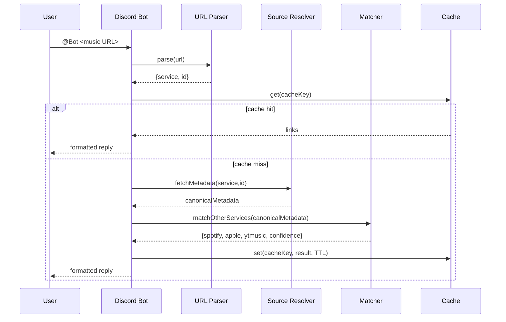

# Discord 音楽リンク変換 Bot 設計書（メンション + URL → Spotify / Apple Music / YouTube Music を整形して返信）

## 0. 概要

Discord 上で **Bot へのメンション + 音楽URL** を受け取り、対象曲を特定して **Spotify / Apple Music / YouTube Music** のリンクをまとめた **フォーマット済みメッセージ** を返信する。

※ 現在は **Spotify / YouTube Music** を対象とし、**Apple Music は対応予定**。

利用予定ライブラリ：

* Apple Music：`Musish/Musish`（※後述：ライブラリというより実装リファレンス）
* YouTube Music：`zS1L3NT/ts-npm-ytmusic-api`（NPM: `ytmusic-api`）
* Spotify：`thelinmichael/spotify-web-api-node`

---

## 1. 目的 / 非目的

### 目的

* URL（Spotify/Apple Music/YouTube Music/YouTube）から **曲（track/song）を同定**
* 他プラットフォームを検索して **同一曲のリンクを推定**（高確度でマッチ）
* Discord に **見やすい整形**で返信（必要なら Embed）

### 非目的（初期スコープ外）

* プレイリスト/アルバムの完全変換（まずは track/song に限定推奨）
* ユーザーごとの Spotify/Apple Music アカウント連携（/me 系 API）
* 楽曲再生、キュー管理などの音楽Bot機能
* Apple Music API 連携の本実装（Developer Token 運用を含む）は対応予定

---

## 2. 重要な前提とリスク

### Apple Music（Musish）

Musish は **Apple Music API を使う Web アプリ**で、動かすには **Apple Developer Token(JWT)** が必要です。([GitHub][1])
→ Bot 側でも **Apple Music API を叩くには Developer Token が必要**（公式仕様）。([Apple Developer][2])
**結論**：`Musish` は「そのまま npm で使う SDK」ではなく、**実装参照（トークン生成・API利用の実例）**として扱うのが現実的です。

### YouTube Music（ts-npm-ytmusic-api）

README 上 **“Unofficial / scraper”** と明記され、データの不整合も起きうる前提です（型が 95% 程度一致など）。([GitHub][3])
→ 利用規約/安定性リスクがあるため、**リトライ・フォールバック・キャッシュ**を強めに設計します。

### Spotify（spotify-web-api-node）

Spotify API は **アクセストークン必須**で、Authorization Code / Client Credentials / Implicit のフローに対応。([GitHub][4])
本用途（検索/参照中心）なら **Client Credentials** が最小で済みます。([GitHub][4])
（なおライブラリ自体のリリースは 2021 のタグが見えるので、動作検証は必須）。([GitHub][5])

---

## 3. ユースケース & 入出力仕様

### トリガー（メッセージ）

* ユーザー：`@Bot https://open.spotify.com/track/...`
* 返信：対象曲のタイトル/アーティスト + 各サービス URL を整形して返信

### 入力 URL 対応（初期）

* Spotify: `open.spotify.com/track/{id}`（優先対応）
* Apple Music: `music.apple.com/{storefront}/...`（song id を抽出）
* YouTube Music: `music.youtube.com/watch?v={videoId}`
* （任意）通常 YouTube: `youtube.com/watch?v=...` → 可能なら YT Music として扱う

### 出力フォーマット（例）

* **🎵 {Title} — {Artist}**
* Spotify: `<...>`
* Apple Music: `<...>`
* YouTube Music: `<...>`
* （任意）マッチ信頼度：`match: high/medium/low`

---

## 4. Discord 側設計

### 実装方式

* Gateway Bot（`messageCreate`）でメンションを検知
* メンションが含まれるメッセージは、Message Content の扱いが比較的安全（「メンションされないメッセージ」には特権 intent が必要と明記）。([discord.js][6])

  * ただし運用面では **Message Content Intent を有効化**するか、将来のために **Slash Command 併設**を推奨（初期はメンション仕様でOK）

### ルーティング条件

* `message.author.bot` は無視
* `message.mentions.has(client.user)` が true
* URL を 1 つ以上抽出（複数ある場合は先頭 or すべて対応を選ぶ）

---

## 5. 全体アーキテクチャ

### コンポーネント

1. **Discord Adapter**

   * messageCreate を受信
   * URL 抽出・返信送信

2. **URL Parser**

   * 入力 URL を正規化
   * サービス判定（Spotify/Apple/YT Music）
   * ID 抽出（trackId / songId / videoId）

3. **Source Resolver（入力元のメタデータ取得）**

   * Spotify: track API（タイトル、アーティスト、duration、ISRC など）
   * Apple Music: song API（可能なら ISRC を取得）
   * YT Music: videoId からメタデータ（タイトル、アーティスト、duration）

4. **Cross-service Matcher（他サービス検索）**

   * **ISRC が取れる場合は最優先**

     * Apple Music は `filter[isrc]` でカタログ song を引ける（複数返ることもある）。([Apple Developer][7])
   * ISRC が無い/使えない場合はクエリ検索

     * Apple Music: catalog search（term, types 等）([Apple Developer][8])
     * Spotify: searchTracks（title + artist）
     * YT Music: search（title + artist）

5. **Scoring / Decision（同一曲推定）**

   * 候補にスコア付けして最良を採用（後述）

6. **Cache**

   * 入力URL→出力3リンク の結果を TTL キャッシュ
   * 可能なら **ISRC** または正規化キー（`artist|title|duration`）でもキャッシュ

7. **Formatter**

   * Discord メッセージ or Embed を組み立て

---

## 6. データフロー（シーケンス）

---

## 7. マッチング戦略（精度の肝）

### 7.1 正規化

* タイトル：全角/半角、大小、記号、`(Remastered)`, `- Live` 等の扱いを統一
* アーティスト：`feat.` / `ft.` / `&` の分割、主要アーティスト優先
* duration：±5〜10秒程度を許容（プラットフォーム差）

### 7.2 優先順位

1. **ISRC が取れるなら最優先**

   * Spotify track から ISRC を取得できることが多い（Bot 側で確認実装）
   * Apple Music は `filter[isrc]` で検索可能（複数返ることがあるので追加判定）。([Apple Developer][7])

2. **テキスト検索（title + artist）**

   * Apple Music catalog search の `term` と `types=songs` などを利用。([Apple Developer][8])
   * Spotify は `searchTracks`
   * YT Music は `ytmusic.search(query)`（結果のぶれを想定）

### 7.3 スコアリング例（合計 0〜100）

* タイトル一致度（0〜40）
* アーティスト一致度（0〜35）
* duration 差分（0〜15）
* 追加信号（0〜10）

  * explicit の一致、アルバム名、リリース年など（取れる範囲で）

### 7.4 信頼度（confidence）

* `high`: ISRC 一致 or スコア >= 85
* `medium`: スコア 70〜84
* `low`: スコア < 70（出すが注意表示）

---

## 8. 各サービス実装方針

### 8.1 Spotify（spotify-web-api-node）

* 認証：**Client Credentials flow**（ユーザー許可不要）([GitHub][4])
* 取得：track id → track metadata（タイトル/アーティスト/duration/ISRC）
* 検索：`searchTracks("track:{title} artist:{artist}")` のような構造化検索も検討

### 8.2 Apple Music（Musish を参照して Apple Music API を直接利用）

* Developer Token(JWT) が必要（Musish も同条件）。([GitHub][1])
* 可能なら ISRC ルート：

  * `GET /v1/catalog/{storefront}/songs?filter[isrc]={isrc}` ([Apple Developer][7])
* それ以外：

  * catalog search（term, types=songs）([Apple Developer][8])
* storefront：`jp` 固定でもよいが、サーバー/ギルド設定で変更可能にするのが安全

### 8.3 YouTube Music（ts-npm-ytmusic-api）

* `initialize()`（必要なら cookie を渡せる）([GitHub][3])
* input が YT Music URL の場合：videoId でメタデータ取得
* 他サービスからの変換：`search("{title} {artist}")` → song 優先で候補選別
* 不整合（null や型ズレ）を前提に **例外処理 + リトライ + フォールバック**を標準装備（README の注意通り）([GitHub][3])

---

## 9. キャッシュ / レート制御

### キャッシュ

* キー候補

  * 入力URLの正規化文字列
  * 取得できるなら `ISRC`
  * それ以外は `norm(artist)|norm(title)|durationBucket`
* TTL：24h〜72h（API負荷と鮮度のバランス）

### レート制御

* ユーザー単位：例）10回/分
* ギルド単位：例）60回/分
* 連投スパム抑止：同一URLは短時間で 1 回だけ返信（キャッシュで吸収）

---

## 10. エラー処理 / フォールバック

* URL パース失敗：使い方を返信（例：「@Bot <URL>」）
* 入力元 API が落ちた：該当サービスだけ `N/A` 表示
* マッチ低信頼：`low` と明示しつつリンク提示（ユーザーが確認できる）
* YT Music が不安定な場合：

  * 一時的に YT Music をスキップできるフラグ（`DISABLE_YTMUSIC=true`）を用意

---

## 11. セキュリティ / 運用

### シークレット

* Spotify: `SPOTIFY_CLIENT_ID`, `SPOTIFY_CLIENT_SECRET`
* Apple Music: `APPLE_TEAM_ID`, `APPLE_KEY_ID`, `APPLE_PRIVATE_KEY`（または生成済み JWT）
* Discord: `DISCORD_BOT_TOKEN`

### ログ

* request id、入力 URL、マッチ結果、confidence、各APIレイテンシ
* 個人情報は保持しない（メッセージ本文の全文保存は避ける）

---

## 12. デプロイ構成（最小）

* Node.js 実行環境（VPS / コンテナ）
* 1プロセス構成（必要なら PM2 / systemd）
* 追加オプション：Redis（キャッシュ/レート制御を堅牢化）

---

## 13. テスト計画

### 単体テスト

* URL parser（各サービスURL→id抽出）
* 正規化（title/artist の変換）
* スコアリング（境界値）

### 結合テスト

* Spotify URL → Apple/YT Music 検索 → 返信生成
* Apple URL → Spotify/YT Music
* YT Music URL → Spotify/Apple

### 回帰用 fixture

* よくある揺れ（Remix/Live/feat/日本語タイトル）を固定セット化

---

## 14. 実装メモ（設計上の注意点）

* **Musish は SDK ではない**ので、「Apple Music API を叩くための参考実装」として取り込み、Bot 側は **Apple Music API クライアントを別モジュール**として持つのが実装コストと保守性のバランスが良いです。([GitHub][1])
* Apple Music は ISRC で直接引けるため、Spotify→Apple の精度を上げるなら **ISRC ルートを基本**に据えるのが強いです。([Apple Developer][7])
* YT Music は非公式スクレイパー前提なので、**落ちても全体が落ちない設計**（部分成功）に寄せるのが実運用で効きます。([GitHub][3])

---

## 15. Apple Music 実装手順（対応予定）

Apple Music は **初期リリースから切り離し**、Spotify + YouTube Music の安定運用後に段階導入する。

### 15.1 段階的な実装順序

1. **先行リリース（現行）**

   * Spotify URL / YouTube Music URL の相互変換を先に提供
   * マッチング、キャッシュ、レート制御、監視ログを先に安定化

2. **Apple Music 追加（対応予定）**

   * Apple Developer Token の発行フローを整備
   * Apple Music API クライアントを追加（ISRC ルート優先）
   * `music.apple.com` URL パーサーと Matcher の Apple 分岐を有効化

3. **運用最適化**

   * storefront のギルド設定化（`jp` 固定から拡張）
   * エラー率/遅延を見て Apple 側のリトライやキャッシュ TTL を調整

### 15.2 Apple Music 対応の具体タスク

* 環境変数追加：`APPLE_TEAM_ID`, `APPLE_KEY_ID`, `APPLE_PRIVATE_KEY`（または `APPLE_DEVELOPER_TOKEN`）
* JWT 発行モジュール実装（期限管理・自動更新）
* API 実装：

  * `GET /v1/catalog/{storefront}/songs?filter[isrc]={isrc}`
  * `GET /v1/catalog/{storefront}/search?term={term}&types=songs`
* 例外系実装：

  * Token 期限切れ時の再生成
  * storefront 非対応時のフォールバック
  * 候補複数時のスコア選別
* テスト追加：

  * Spotify→Apple（ISRC 一致）
  * Apple→Spotify（title/artist 検索）
  * Apple API 障害時の部分成功レスポンス

### 15.3 着手条件（Go / No-Go）

* 先行リリースで以下を満たしたら着手：

  * 変換成功率（Spotify↔YT Music）が目標値を満たす
  * API エラー率と返信遅延が許容範囲に収まる
  * 運用ログと障害対応フローが確立している
